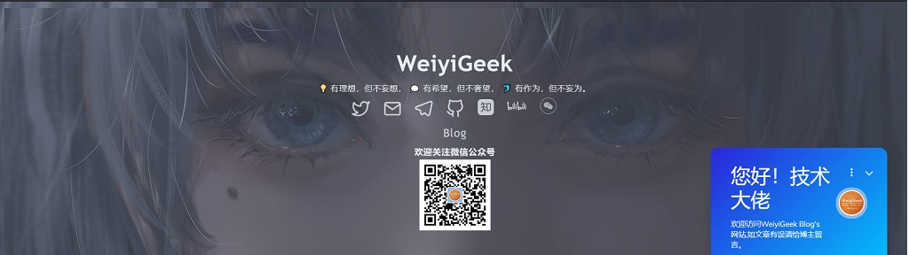

| **Site**| **Blog**                             | **Twitter**                              | **Channel**                            | **Telegram**                             |
|-----| ------------------------------------ | ---------------------------------------- | -------------------------------------- | ---------------------------------------- |
|🌐 [www.weiyigeek.top](https://www.weiyigeek.top)| 🌐 [blog.weiyigeek.top](https://blog.weiyigeek.top) | 🕊 [@WeiyiGeek](https://twitter.com/weiyigeek) | 📣 [RSS_CloudSecOpsDev (aboard)](https://t.me/s/rss_secdevops)   📣 [RSS_CloudSecOpsDev (国内)](https://tg.weiyigeek.top) | ☎️ [WeiyiGeek](https://telegram.me/weiyigeek) |

| **哔哩哔哩** | **知乎** | **微信公众号** | **书籍推荐**  | **沟通交流** |
|---|---|---|---------------------------------------- |-----|
|🌐 [BiliBili](https://space.bilibili.com/385802642) | 🌐 [Zhihu](https://www.zhihu.com/people/weiyiSec) | 📣 [WeiyiGeek](https://weiyigeek.top/wechat.html?key=%E6%AC%A2%E8%BF%8E%E5%85%B3%E6%B3%A8) | 📘 [Books](https://blog.weiyigeek.top/books/) | 👋 [学习交流群](https://weiyigeek.top/visit.html) |

---

温馨提示：微信小程序【极客全栈修炼】上线了，可以直接在微信中浏览唯一极客技术博客（ https://blog.weiyigeek.top ）中的相关文章，涉及网络安全、系统运维、应用开发、物联网实战、全栈文章，希望和大家一起学习进步，欢迎浏览交流！  

  

