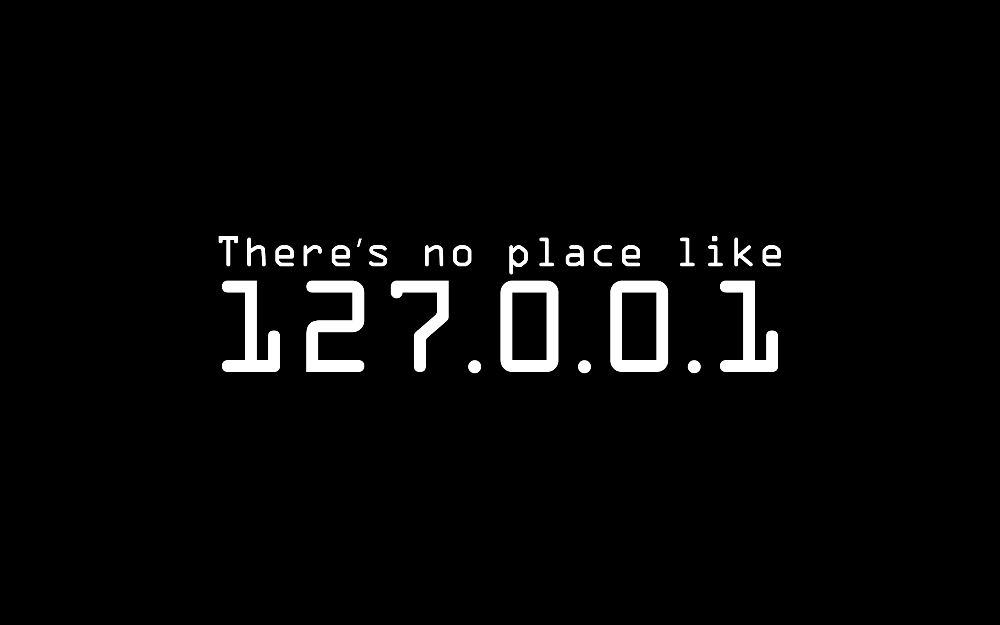

| **Site**| **Blog**                             | **Twitter**                              | **Channel**                            | **Telegram**                             | **Books**                                |
|-----| ------------------------------------ | ---------------------------------------- | -------------------------------------- | ---------------------------------------- | ---------------------------------------- |
|🌠[www.weiyigeek.top](https://www.weiyigeek.top)| 🌠[blog.weiyigeek.top](https://blog.weiyigeek.top) | 🕊 [@WeiyiGeek](https://twitter.com/weiyigeek) | 📣 [RSS_CloudSecOpsDev (aboard)](https://t.me/s/rss_secdevops)   📣 [RSS_CloudSecOpsDev (国内)](https://tg.weiyigeek.top) | â˜ï¸ [WeiyiGeek](https://telegram.me/weiyigeek) | 📘 [Books](https://blog.weiyigeek.top/books/) |

**Power by [-muzi502-] , All rights reserved to the author [-muzi502-](https://github.com/muzi502/muzi502).**